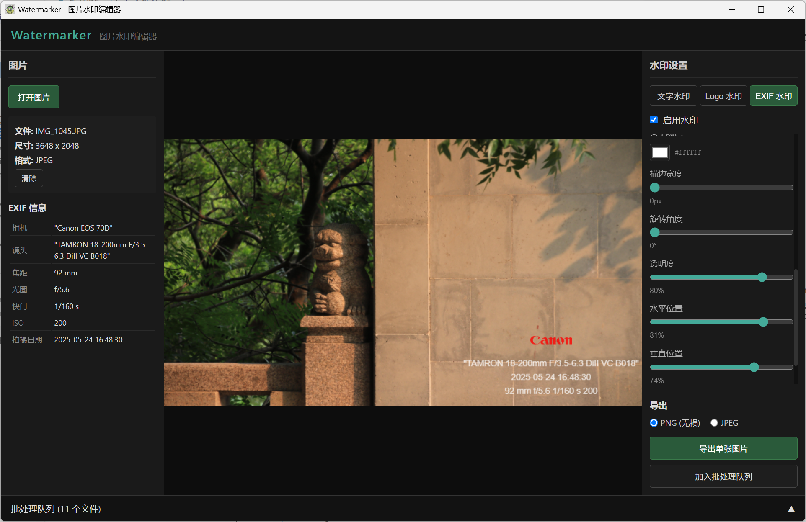

# Watermarker — Image Watermark Editor

[简体中文](./README.md)

A lightweight, cross-platform image watermarking application built with **Tauri v2 + Vue 3 + TypeScript**.

Want to personalize your photos but can't be bothered to manually add and adjust watermarks? Tired of tweaking watermarks on hundreds of photos one by one? Watermarker is here to help.

Whether it's a single text watermark, tiled text watermarks, a custom logo, or shooting parameters… Watermarker focuses exclusively on watermark processing, shedding other image-editing features in pursuit of a lightweight experience.
Install this watermark editor — weighing just a few megabytes — via a one-click installer, dial in your watermark settings, import all your photos, and apply watermarks in a single click. We pursue simplicity and convenience.

Watermarks use a **"relative size"** and **"relative position"** scheme that automatically adapts to photos of different dimensions. Per-image watermark customization within the batch queue is also supported — fast and polished.

Originally born from an amateur photography enthusiast's UML modeling course assignment. As a novice developer's work, feedback and suggestions are most welcome!For learning and self-usage. More than glad if this project helps!



## Features

- **Image Loading** — Supports JPG / PNG / BMP / WebP formats
- **EXIF Metadata Display** — Camera model, lens, aperture, shutter speed, ISO, focal length, GPS, and more
- **EXIF Trademark Logo** — Canon / Nikon / Sony cameras automatically replace model text with manufacturer logo
- **Text Watermark** — Customizable text, font size, color, position, opacity; supports **tile mode**
- **Logo Watermark** — PNG / JPG / SVG / WebP as watermark layer; adjustable scale, position, and opacity
- **Live Canvas Preview** — WYSIWYG; preview matches export output exactly
- **Single Export** — Full-resolution rendering; supports PNG (lossless) and JPEG (maximum quality)
- **Batch Processing** — Multi-file queue with frontend Canvas rendering, ensuring batch results match preview
- **Cross-Platform** — Windows NSIS installer + macOS DMG installer
- **Lightweight** — Installer < 10MB

## Quick Start

### Installation

Click the links below to download the installer for your operating system:

[](https://github.com/06FallingLight90/watermarker/releases/download/v0.4.0/Watermarker_0.4.0_x64-setup.exe)

[](https://github.com/06FallingLight90/watermarker/releases/download/v0.4.0/Watermarker_0.4.0_aarch64.dmg)

[](https://github.com/06FallingLight90/watermarker/releases/download/v0.4.0/Watermarker_0.4.0_amd64.AppImage)

### Requirements

- **Node.js** >= 18
- **Rust** >= 1.70 (MSVC toolchain)
- **OS**: Windows 10+ (requires WebView2) / macOS 11+ / Linux

### Development

```bash
# Install frontend dependencies
npm install

# Start Tauri dev mode (with HMR)
npm run tauri dev
```

### Build Release Package

```bash
# Build platform-native installer
npm run tauri build
```

Build artifacts are located in the `src-tauri/target/release/bundle/` directory.

## Project Structure

```
watermarker/
├── src/                        # Vue 3 frontend source
│   ├── components/             # Vue components
│   │   ├── watermark/          # Watermark type sub-panels
│   │   │   ├── TextWatermarkPanel.vue   # Text watermark settings
│   │   │   ├── LogoWatermarkPanel.vue   # Logo watermark settings
│   │   │   ├── ExifWatermarkPanel.vue   # EXIF watermark settings
│   │   │   └── ExifFieldStylePanel.vue  # EXIF field styles
│   │   ├── export/             # Export related
│   │   │   └── ExportSection.vue        # Format selection & export button
│   │   ├── LeftPanel.vue       # File open & EXIF info
│   │   ├── CenterCanvas.vue    # Live Canvas preview
│   │   ├── RightPanel.vue      # Watermark settings container (type tabs + sub-panels)
│   │   └── BatchPanel.vue      # Batch processing panel
│   ├── composables/            # Composition logic
│   │   ├── useCanvas.ts        # Canvas preview composable (re-exports drawing functions)
│   │   ├── useWatermarkDrawing.ts  # Pure Canvas drawing functions (text/logo/EXIF)
│   │   ├── useFontLoader.ts    # System font scanning + custom font loading
│   │   └── useTauriCommands.ts # Typed Tauri command wrappers
│   ├── stores/                 # Pinia state management
│   │   ├── image.ts            # Current image & rendered result
│   │   ├── watermark.ts        # Watermark configuration
│   │   └── batch.ts            # Batch processing state
│   ├── types/index.ts          # TypeScript type definitions
│   ├── assets/
│   │   └── trade_marks/        # Canon / Nikon / Sony trademark PNGs
│   ├── utils/
│   │   ├── colorConvert.ts     # rgbToHex / hexToRgb color conversion
│   │   └── tradeMarks.ts       # Trademark image preloading & brand matching
│   ├── styles/
│   │   └── shared.css          # Shared form/control styles across panels
│   ├── App.vue                 # Root component (three-column layout)
│   ├── main.ts                 # Application entry point
│   └── style.css               # Global styles
├── src-tauri/                  # Rust backend
│   ├── src/
│   │   ├── main.rs             # Program entry point
│   │   ├── lib.rs              # Tauri command registration
│   │   ├── commands/           # Tauri command layer
│   │   │   ├── image.rs        # Image load/export commands
│   │   │   ├── exif.rs         # EXIF read commands
│   │   │   ├── watermark.rs    # Watermark rendering commands
│   │   │   └── batch.rs        # Batch processing commands
│   │   └── engine/             # Rendering engine
│   │       ├── image.rs        # Image I/O & format conversion
│   │       ├── exif.rs         # EXIF parser
│   │       ├── text.rs         # Text watermark rendering (ab_glyph + imageproc)
│   │       └── overlay.rs      # Logo watermark rendering (alpha blending)
│   ├── Cargo.toml              # Rust dependencies
│   └── tauri.conf.json         # Tauri window & bundling config
├── .github/workflows/build.yml # CI/CD automated builds
├── package.json                # Node dependencies & scripts
├── vite.config.ts              # Vite build configuration
└── docs/                       # Project documentation
```

## Tech Stack

| Layer | Technology | Description |
|-------|------------|-------------|
| Desktop Framework | Tauri v2 | Rust + WebView, lightweight & cross-platform |
| Frontend Framework | Vue 3 + Composition API | Reactive UI |
| State Management | Pinia | Type-friendly Vue state management |
| Build Tool | Vite 6 | Fast development & bundling |
| Type Checking | TypeScript 5.5 | Type safety |
| Image Processing (Rust) | image 0.25, imageproc 0.25, ab_glyph 0.2 | Server-side image decode/encode/watermark |
| EXIF Parsing | kamadak-exif 0.6 | Reading photo metadata |
| Image Rendering (Frontend) | HTML5 Canvas API | Preview & full-resolution export |

## Related Documentation

- **[Tutorial](TUTORIAL.md) ← Start here if you're new!** A progressive, code-referenced guide to the system architecture, data flow, and tech stack
- [Architecture](ARCHITECTURE.md) — Rendering pipeline, data flow, design decisions
- [Development & CI/CD Workflow](WORKFLOW.md) — Local builds, release process, automated builds
- [Changelog](CHANGELOG.md) — Version history & change log
